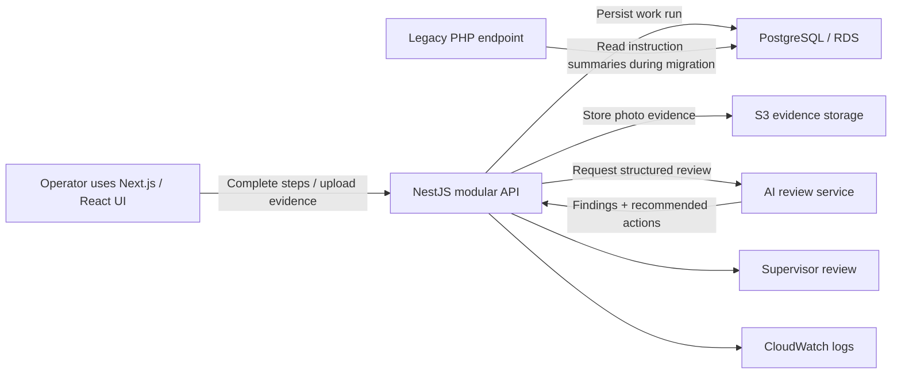

# Architecture

## Design Choices

- Keep deterministic validation separate from AI recommendations.
- Use request IDs across UI, API, logs, database rows, and evidence paths.
- Treat the PHP layer as a compatibility bridge, not a dumping ground for new logic.
- Use relational tables for auditability because manufacturing quality workflows need traceable state.
- Keep frontend components typed and accessible so the operator workflow is clear.

